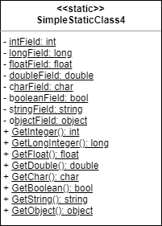
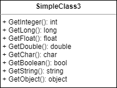
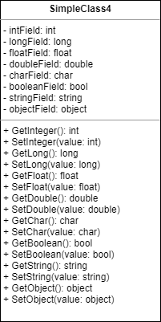

# UML Design Basics

A beginner level task for practicing creating and designing classes using UML diagrams for describing class structure and behavior.  

Before starting with the task learn the basics of [UML language](https://en.wikipedia.org/wiki/Unified_Modeling_Language) and [UML Class Diagrams](https://en.wikipedia.org/wiki/Class_diagram). Search YouTube for [relevant video tutorials](https://www.youtube.com/results?search_query=uml+class+diagram) to get started quickly. Don't waste time! You don't have to master the UML Class Diagrams. You just need to get a [basic understanding on the topic](https://www.tutorialspoint.com/object_oriented_analysis_design/ooad_uml_basic_notation.htm), and you can always find the answer to your question in the [UML Class Diagrams Reference](https://www.uml-diagrams.org/class-reference.html). 

Estimated time to complete the task: 6h.


## Task

The task has twenty four sections with small sub-tasks. After completing a section, read materials in "Additional Reading" section and answer the questions in "Step Questions" section. 


### Visual Studio

Visual Studio has a special feature to help you quickly find specified items. You can go to a specific file, type, symbol or class member with [Go To commands](https://docs.microsoft.com/en-us/visualstudio/ide/go-to). Navigation with Go To commands is much more productive than using Solution Explorer pane.

Visual Studio Code has similar features for [quick file navigation](https://code.visualstudio.com/docs/editor/editingevolved#_quick-file-navigation).


### 1. Static Class

Open the [SimpleStaticClass1.cs](UmlDesignBasics/SimpleStaticClass1.cs) file, and add the code to declare a new [static class](https://docs.microsoft.com/en-us/dotnet/csharp/programming-guide/classes-and-structs/static-classes-and-static-class-members) with the name _SimpleStaticClass1_. The class should have ["public"](https://docs.microsoft.com/en-us/dotnet/csharp/language-reference/keywords/public) [access modifier](https://docs.microsoft.com/en-us/dotnet/csharp/programming-guide/classes-and-structs/access-modifiers) and no class members.

Example 1. Static class declaration.

```cs
public static class SimpleStaticClass1
{
}
```

Class diagram 1. _SimpleStaticClass1_ static class. 

.

NB: "<<static>>" is a custom [UML stereotype](https://www.uml-diagrams.org/stereotype.html), not a standard UML notation. That means the representation of a static class may be different on other class diagrams.

### Additional Reading

* [What is a "static" class](https://stackoverflow.com/questions/695056/what-is-a-static-class)

### Step Questions

* What is a static class?
* What UML notation is used to describe a static class on a class diagram?


### 2. Static Fields

Open the [SimpleStaticClass2.cs](UmlDesignBasics/SimpleStaticClass2.cs) file, add the code to declare a new public static class with the name _SimpleStaticClass2_, and add the [static fields](https://docs.microsoft.com/en-us/dotnet/csharp/programming-guide/classes-and-structs/static-classes-and-static-class-members#static-members) using the information from the table below:

| Field Name   | Field Type | Field Access Modifier | UML Visibility Type |
|--------------|------------|-----------------------|---------------------|
| intField     | int        | private               | -                   |
| longField    | long       | private               | -                   |
| floatField   | float      | private               | -                   |
| doubleField  | double     | private               | -                   |
| CharField    | char       | public                | +                   |
| BooleanField | bool       | public                | +                   |
| StringField  | string     | public                | +                   |
| ObjectField  | object     | public                | +                   |

Example 2. Static field declaration.

```cs
private static int intField;
```

Class diagram 2. _SimpleStaticClass2_ static class.

.

Class diagram explanation:
* The "-" sign before an [attribute](https://www.uml-diagrams.org/property.html#classifier-attribute) name defines the ["private" visibility type](https://www.uml-diagrams.org/visibility.html?context=class-diagrams). That means a class field should have a ["private" access modifier](https://docs.microsoft.com/en-us/dotnet/csharp/language-reference/keywords/private).
* The "+" sign before an attribute name defines the "public" visibility type. That means a class field should have the ["public" access modifier](https://docs.microsoft.com/en-us/dotnet/csharp/language-reference/keywords/public).
* Class attributes are [underlined](https://www.uml-diagrams.org/uml-core.html#static-feature) - the class fields should have the ["static" modifier](https://docs.microsoft.com/en-us/dotnet/csharp/language-reference/keywords/static).

**SA1202:** If you have a SA1202 StyleCop warning during the project compilation, read the [rule description on the documentation page](https://github.com/DotNetAnalyzers/StyleCopAnalyzers/blob/master/documentation/SA1202.md) and fix an instance of this violation by changing the order of the class fields.

The _SimpleStaticClass2.cs_ file contains [pragma preprocessor directives](https://docs.microsoft.com/en-us/dotnet/csharp/language-reference/preprocessor-directives) to suppress issue reporting by the code analysis tools:
* SA1401, CA2211. Code analysis tools treat non-constant public or protected fields as a suspicious code. Read the [SA1401](https://github.com/DotNetAnalyzers/StyleCopAnalyzers/blob/master/documentation/SA1401.md) and [CA2211](https://docs.microsoft.com/en-us/dotnet/fundamentals/code-analysis/quality-rules/ca2211) documentation pages to get more details why having private fields is important for code maintainability. 
* CA1823, CS0169. The class fields are not used anywhere in the code, and compiler treats unused private fields as a suspicious code. Read the [CA1823](https://docs.microsoft.com/en-us/dotnet/fundamentals/code-analysis/quality-rules/CA1823) and [CS0169](https://docs.microsoft.com/en-us/dotnet/csharp/misc/cs0169) documentation pages to get more details.

### Additional Reading

* [Access Modifiers (C# Programming Guide)](https://docs.microsoft.com/en-us/dotnet/csharp/programming-guide/classes-and-structs/access-modifiers)
* [Access Modifiers (C# Reference)](https://docs.microsoft.com/en-us/dotnet/csharp/language-reference/keywords/access-modifiers)
* [Accessibility Levels (C# Reference)](https://docs.microsoft.com/en-us/dotnet/csharp/language-reference/keywords/accessibility-levels)

### Step Questions

* What is a static field?
* What is an access modifier?
* What access modifiers do you know?
* What is the difference between public and private accessibility levels?
* What is the difference between public and private access modifiers?
* What UML notation is used to describe a static field on a class diagram?


### 3. Static Methods

Open the [SimpleStaticClass3.cs](UmlDesignBasics/SimpleStaticClass3.cs) file, add the code to declare a new public static class with the name _SimpleStaticClass3_, and add the [static methods](https://docs.microsoft.com/en-us/dotnet/csharp/programming-guide/classes-and-structs/static-classes-and-static-class-members#static-members) using the information from the table below:

| Method Name    | Return Type | Return Value | Field Access Modifier | UML Visibility Type |
|----------------|-------------|--------------|-----------------------|---------------------|
| GetInteger     | int         | -101         | private               | -                   |
| GetLongInteger | long        | 101          | public                | +                   |
| GetFloat       | float       | 1.01         | private               | -                   |
| GetDouble      | double      | 0.101        | public                | +                   |
| GetChar        | char        | 'a'          | public                | +                   |
| GetBoolean     | bool        | true         | private               | -                   |
| GetString      | string      | "abc"        | public                | +                   |
| GetObject      | object      | null         | private               | -                   |

A method should return a literal as a return value. 

Example 3. Static method declaration.

```cs
private static int GetInteger()
{
    return -101;
}
```
Class diagram 3. _SimpleStaticClass3_ static class.

.

### Additional Reading

* [Static Classes and Static Class Members (C# Programming Guide)](https://docs.microsoft.com/en-us/dotnet/csharp/programming-guide/classes-and-structs/static-classes-and-static-class-members)

### Step Questions

* What is a static method?
* Is it possible to instantiate a static class?
* Is it possible to use the "new" operator to create a variable of the static class type?
* Is it possible to invoke a private static method from the outside of a class?

```cs
int i = SimpleStaticClass3.GetInteger(); // ?
```

* Is it possible to invoke a public static method from the outside of a class?

```cs
long i = SimpleStaticClass3.GetLongInteger(); // ?
```

* Is it possible to invoke a private static method from another static method of a class?

```cs
public static long GetLongInteger()
{
    return SimpleStaticClass3.GetInteger() + 101L; // ?
}
```

* What UML notation is used to describe a static method on a class diagram?
* What UML notation is used to define a public and private visibility types for a static class member on a class diagram?


### 4. Static Fields Initialization

Analyze the class diagram below and add the _SimpleStaticClass4_ static class code to the [SimpleStaticClass4.cs](UmlDesignBasics/SimpleStaticClass4.cs) file. 

Class diagram 4. _SimpleStaticClass4_ static class.

.

Add field initializers for all static fields using the values from the table below:

| Field Name   | Field Initializer Value    |
|--------------|----------------------------|
| intField     | 212                        |
| longField    | -232                       |
| floatField   | 2.12                       |
| doubleField  | 2.121                      |
| charField    | 'b'                        |
| booleanField | true                       |
| stringField  | "def"                      |
| objectField  | typeof(SimpleStaticClass4) |

Example 4.1. A field initializer.

```cs
private static int intField = 212;
```

Implement the static methods to return the relevant values of the private static fields. 

Example 4.2. Accessing a static field in a static method using a class name.

```cs
public static int GetInteger()
{
    return SimpleStaticClass4.intField;
}
```

A static method may access a static field or another member without using a class name.

Example 4.3. Accessing a static field in a static method without using a class name.

```cs
public static int GetInteger()
{
    return intField;
}
```
Code in 4.2 and 4.3 examples are equivalent. 


### 5. Class

Open the [SimpleClass1.cs](UmlDesignBasics/SimpleClass1.cs) file, and add the code to declare a new public [class](https://docs.microsoft.com/en-us/dotnet/csharp/fundamentals/types/classes) with the name _SimpleClass1_. The class should have no class members.

Example 5. Class declaration.

```cs
public class SimpleClass1
{
}
```

Class diagram 5. _SimpleClass1_ class.

.

#### Additional Reading

Read the [Objects - create instances of types](https://docs.microsoft.com/en-us/dotnet/csharp/fundamentals/object-oriented/objects) article to understand the class and object concepts.

> A class or struct definition is like a blueprint that specifies what the type can do. An object is basically a block of memory that has been allocated and configured according to the blueprint. A program may create many objects of the same class. Objects are also called instances, and they can be stored in either a named variable or in an array or collection.

Read the [Objects and Classes](https://www.tutorialspoint.com/object_oriented_analysis_design/ooad_object_oriented_model.htm) section in the "OOAD" tutorial:

> A class represents a collection of objects having same characteristic properties that exhibit common behavior. It gives the blueprint or description of the objects that can be created from it. Creation of an object as a member of a class is called instantiation. Thus, object is an instance of a class.

Also, read the [Reference types and Declaring Classes](https://docs.microsoft.com/en-us/dotnet/csharp/fundamentals/types/classes#declaring-classes) sections.

#### Step Questions

* What is the difference between the class and the object concepts?
* What is the difference between the static class and the non-static class?
* Is it possible for a static class to have a non-static class member?
* Is it possible for a non-static class to have a static class member?
* What UML notation is used to describe a class on a class diagram?


### 6. Instance Fields

Open the [SimpleClass2.cs](UmlDesignBasics/SimpleClass2.cs) file, and add the code to declare a new public _SimpleClass2_ class with [instance fields](https://docs.microsoft.com/en-us/dotnet/csharp/programming-guide/classes-and-structs/fields) using the information from the table below:

| Field Name   | Field Type | Field Access Modifier |
|--------------|------------|-----------------------|
| IntField     | int        | public                |
| longField    | long       | private               |
| FloatField   | float      | public                |
| DoubleField  | double     | public                |
| charField    | char       | private               |
| BooleanField | bool       | public                |
| stringField  | string     | private               |
| objectField  | object     | private               |

Example 6. An instance field declaration.

```cs
public int IntField;
```

Class diagram 6. _SimpleClass2_ class.

.

Class diagram explanation:
* Class attributes in the diagram are not underlined - the class fields should not have the "static" modifier.
* The "+" and "-" signs before an attribute name define the "public" and "private" visibility types. 

#### Additional Reading

Read [Objects and Classes](https://www.tutorialspoint.com/object_oriented_analysis_design/ooad_object_oriented_model.htm) to understand the state and the behavior concepts:  

> State that determines the characteristic properties of an object as well as the values of the properties that the object holds.

> Behavior that represents externally visible activities performed by an object in terms of changes in its state.

The state of an object of the _SimpleClass2_ class is a set of the _SimpleClass2_ fields and the values of these fields.

A class with fields only is a simple [data structure](https://en.wikipedia.org/wiki/Data_structure). 

#### Step Questions

* What is a class field?
* What is the difference between the class state and the class behavior concepts?
* What is the difference between the static and non-static class fields?
* Does the SimpleClass2 class have the class state and behavior?
* What UML notation is used to describe a class field on a class diagram?


### 7. Class Instantiation

Open the [CreatingSimpleClass2](UmlDesignBasics/CreatingSimpleClass2.cs) class, and add the implementation for _CreateSimpleClass2_ method - a method should create a new object of _SimpleClass2_ class and set all public fields.

| Field Name   | Value  |
|--------------|--------|
| IntField     | -331   |
| FloatField   | 13.13  |
| DoubleField  | -31.31 |
| BooleanField | true   |

Example 7.1. Instantiating (creating an instance of) a _SimpleClass2_ class.

```cs
SimpleClass2 simpleClass = new SimpleClass2();

simpleClass.IntField = -331;
// TODO: set other fields here

return simpleClass;
```

Open the [CreatingSimpleClass2](UmlDesignBasics/CreatingSimpleClass2.cs) class, and add the implementation for _CreateSimpleClass2ObjectInitializer_ method - a method should create a new object of _SimpleClass2_ class and set all public fields by using an _object initializer_.

| Field Name   | Value   |
|--------------|---------|
| IntField     | 432     |
| FloatField   | -42.31  |
| DoubleField  | 43.12   |
| BooleanField | false   |

Example 7.2. Initializing an object of SimpleClass2 class by using an object initializer.

```cs
return new SimpleClass2
{
    IntField = 432,
    // TODO: set other fields here
};
```

The objects returned by _CreateSimpleClass2_ and _CreateSimpleClass2ObjectInitializer_ methods has the **state** only, the object has no **behavior**. The state of each object is **different** because the objects contain different values in their fields.

#### Additional Reading

* [Creating objects](https://docs.microsoft.com/en-us/dotnet/csharp/fundamentals/types/classes#creating-objects) section
* [How to initialize objects by using an object initializer](https://docs.microsoft.com/en-us/dotnet/csharp/programming-guide/classes-and-structs/how-to-initialize-objects-by-using-an-object-initializer)

#### Step Questions

* What keyword is used for creating an instance of a class?
* How to use object initializers to initialize an instance of the SimpleClass2 class?


### 8. Instance Methods

Open [SimpleClass3.cs](UmlDesignBasics/SimpleClass3.cs) file, and add the code to declare a new public _SimpleClass3_ class with [instance class method](https://docs.microsoft.com/en-us/dotnet/csharp/methods) using the information from the table below:

| Method Name    | Return Value    |
|----------------|-----------------|
| GetInteger     | MaxValue        |
| GetLong        | MinValue        |
| GetFloat       | Epsilon         |
| GetDouble      | NaN             |
| GetChar        | 'c'             |
| GetBoolean     | true            |
| GetString      | "abcdef"        |
| GetObject      | new object()    |

Example 8. Instance method declaration.

```cs
public int GetInteger()
{
    return int.MaxValue;
}
```

Class diagram 8. _SimpleClass3_ class.

.

Class diagram explanation:
* Class [operations](https://www.uml-diagrams.org/operation.html) in the diagram are not underlined - the class methods should not have the "static" modifier.
* The "+" sign before the [operation](https://www.uml-diagrams.org/operation.html) name defines the "public" visibility type. That means the instance methods should have a "public" access modifier.

#### Step Questions

* What is a class method?
* What is the difference between a static and non-static class method?
* Is it possible to access a public instance method from the outside of a class?

```cs
SimpleClass3 obj = new SimpleClass3();
int i = obj.GetInteger(); // ?
```
* What UML notation is used to describe an instance method on a class diagram?


### 9. Data Hiding

Open [SimpleClass4](UmlDesignBasics/SimpleClass4.cs) class. The class has public instance fields already, but having public instance fields in your classes may lead to runtime issues. That's why code analysis tools report the SA1401 and CA1051 warnings for the _SimpleClass4_ class.

Refactor the code using [Encapsulate Field](https://refactoring.guru/encapsulate-field) (use Java code snippet as an example) technique to hide all instance fields. 

Class diagram 9. _SimpleClass4_ class after refactoring.

.

#### Additional Reading

Read [Encapsulation and Data Hiding](https://www.tutorialspoint.com/object_oriented_analysis_design/ooad_object_oriented_model.htm) section to understand the encapsulation and data hiding concepts:

> Encapsulation is the process of binding both attributes and methods together within a class. Through encapsulation, the internal details of a class can be hidden from outside. It permits the elements of the class to be accessed from outside only through the interface provided by the class.

> Typically, a class is designed such that its data (attributes) can be accessed only by its class methods and insulated from direct outside access. This process of insulating an object’s data is called data hiding or information hiding.

The private fields of _SimpleClass4_ are "insulated from direct outside access". These fields can be accessed only by its class methods since they have "private" access modifier.

Read [Objects and Classes](https://www.tutorialspoint.com/object_oriented_analysis_design/ooad_object_oriented_model.htm) section to understand the behavior concept:

> Behavior that represents externally visible activities performed by an object in terms of changes in its state.

"Externally visible activities" are the class "set"-methods. Those methods are performed by a _SimpleClass4_ object in terms of changes in its state.

#### Step Questions

* Explain the encapsulation and data hiding concepts.
* Is it possible to access a private class field from the outside of a class?

```cs
SimpleClass4 obj = new SimpleClass4();
int i = obj.intField; // ?
```

* Is it possible to access a private class field from a class method?

```cs
public int GetLong()
{
    return this.intField + this.longField; // ?
}
```

* Does the SimpleClass4 class have the class state and behavior?
* What steps has the "Encapsulate Field" refactoring technique?
* What UML notation is used to define a public and private visibility types for a class member on a class diagram?


### 10. Instance Fields Initialization

Create the new _SimpleClass5_ in the [SimpleClass5.cs](UmlDesignBasics/SimpleClass5.cs) file, copy all instance fields and "get" instance methods from _SimpleClass4_ class to the _SimpleClass5_ class, and add field initializers using the information from the table below:

| Field Name   | Field Initializer Value    |
|--------------|----------------------------|
| intField     | -216                       |
| longField    | -621                       |
| floatField   | -54.62                     |
| doubleField  | -62.054                    |
| charField    | 'd'                        |
| booleanField | true                       |
| stringField  | "defabc"                   |
| objectField  | typeof(int)       |

Example 10. Field initializer.

```cs
private int intField = -216;
```

Class diagram 10. _SimpleClass5_ class.

.

An object of the _SimpleClass5_ class is [immutable](https://www.c-sharpcorner.com/article/all-about-c-sharp-immutable-classes2/) because the class has no methods that can change an object _state_.

### Step Questions

* How to initialize a class field using a field initializers when a class is instantiated?
* Whether the _SimpleClass5_ class is immutable or mutable class? Why? 


### 11. Parameterless Constructor

Create the new _SimpleClass6_ class in the [SimpleClass6.cs](UmlDesignBasics/SimpleClass6.cs) file, copy all instance fields and "get" instance methods from _SimpleClass4_ class to the _SimpleClass6_ class, and add public [default parameterless constructor](https://docs.microsoft.com/en-us/dotnet/csharp/programming-guide/classes-and-structs/constructors).

Add the code for initializing class fields to the constructor using the information from the table below:

| Field Name   | Field Initializer Value    |
|--------------|----------------------------|
| intField     | 754                        |
| longField    | 721                        |
| floatField   | -76.67                     |
| doubleField  | 372.127                    |
| charField    | 'e'                        |
| booleanField | true                       |
| stringField  | "ghi"                      |
| objectField  | typeof(float)       |

Example 11. Parameterless constructor.

```cs
private int intField;
// other fields

public SimpleClass6()
{
    this.intField = 754;
    // TODO: set other fields here
}
```

Class diagram 11. _SimpleStaticClass6_ class.

.

NB: "<<constructor>>" is a custom [UML stereotype](https://www.uml-diagrams.org/stereotype.html), not a standard UML notation. A UML class diagram may have [other notation for constructors](https://stackoverflow.com/questions/4006868/uml-classdiagram-constructor-with-parameters).

### Step Questions

* What is a class constructor?
* How to initialize a class field using a parameterless constructor when a class is instantiated?
* Whether the _SimpleClass6_ class is immutable or mutable class? Why?


### 12. Constructor with Parameters

Create the new _SimpleClass7_ class in the [SimpleClass7.cs](UmlDesignBasics/SimpleClass7.cs) file, copy all instance fields and "get" instance methods from _SimpleClass4_ class to the _SimpleClass7_ class, and add a public [constructor with parameters](https://docs.microsoft.com/en-us/dotnet/csharp/programming-guide/classes-and-structs/constructors).

Add the code for initializing class fields to the constructor using the information from the table below:

| Constructor Parameter | Field To Set |
|-----------------------|--------------|
| intValue              | intField     |
| longValue             | longField    |
| floatValue            | floatField   |
| doubleValue           | doubleField  |
| charValue             | charField    |
| boolValue             | booleanField |
| stringValue           | stringField  |
| objectValue           | objectField  |

Example 12. Constructor with parameters.

```cs
private int intField;
// other fields

public SimpleClass7(
    int intValue
    // TODO: add other parameters
)
{
    this.intField = intValue;
    // TODO: set other fields here
}
```

Class diagram 12. _SimpleStaticClass7_ class.

.

Visual Studio has automatic construction generation feature - [Generate a constructor](https://docs.microsoft.com/en-us/visualstudio/ide/reference/generate-constructor).

.

### Step Questions

* What is the difference between a parameterless constructor and a constructor with parameters?
* How to initialize a class field using a constructor with parameters when a class is instantiated?
* Whether the _SimpleClass7_ class is immutable or mutable class? Why?
* What refactoring feature has Visual Studio for constructor generation?


### 13. Properties

Create the new _SimpleClass8_ class in the [SimpleClass8.cs](UmlDesignBasics/SimpleClass8.cs) file, copy all instance fields and instance methods from _SimpleClass4_ class to the _SimpleClass8_ class.

Refactor the class code to replace all "get" and "set" methods with [properties](https://docs.microsoft.com/en-us/dotnet/csharp/programming-guide/classes-and-structs/properties).

| Backing Field Name | Property Name |
|--------------------|---------------|
| intField           | IntValue      |
| longField          | LongValue     |
| floatField         | FloatValue    |
| doubleField        | DoubleValue   |
| charField          | CharValue     |
| booleanField       | BooleanValue  |
| stringField        | StringValue   |
| objectField        | ObjectValue   |

Read about _backing fields_ on [Fields documentation page](https://docs.microsoft.com/en-us/dotnet/csharp/programming-guide/classes-and-structs/fields):

> A private field that stores the data exposed by a public property is called a backing store or backing field.

Example 13.1. Property with "get" and "set" accessors.

```cs
private int intField; // intField is the "backing field"

public int IntValue
{
    get
    {
        return this.intField;
    }
    set
    {
        this.intField = value;
    }
}
```

Compare Java and C# code snippets in [Encapsulate Field](https://refactoring.guru/encapsulate-field) article.

Class diagram 13. _SimpleStaticClass8_ class.

.

NB: "<<get>>" and "<<set>>" are custom [UML stereotypes](https://www.uml-diagrams.org/stereotype.html), not a standard UML notation. A UML class diagram has no special notation for "properties". That's why using a custom stereotype is the only way to define the property.

Another way to implement a property is to use [expression body definition](https://docs.microsoft.com/en-us/dotnet/csharp/programming-guide/statements-expressions-operators/expression-bodied-members#properties).

Example 13.2. Implementation of property "get" and "set" [accessors with expression body definition](https://docs.microsoft.com/en-us/dotnet/csharp/programming-guide/classes-and-structs/properties#expression-body-definitions).

```cs
public int IntValue
{
    get => this.intField;
    set => this.intField = value;
}
```

Visual Studio has a feature for converting "get" and "set" methods to properties - [Convert Get method to property](https://docs.microsoft.com/en-us/visualstudio/ide/reference/convert-get-method-to-property).

.

### Step Questions

* What is a property?
* What is a backing field?
* What is the purpose of property get and set accessors?
* How to use expression body definition for implementing a property?
* Whether the _SimpleClass8_ class is immutable or mutable class? Why?
* What refactoring feature has Visual Studio for converting get and set methods to properties?


### 14. Auto-implemented Properties

Create the new _SimpleClass9_ class in the [SimpleClass9.cs](UmlDesignBasics/SimpleClass9.cs) file, copy all instance properties from _SimpleClass8_ class to the _SimpleClass9_ class.

Refactor the class code to replace all properties with [auto-implemented properties](https://docs.microsoft.com/en-us/dotnet/csharp/programming-guide/classes-and-structs/properties#auto-implemented-properties).

Example 14. Auto-implemented property.

```cs
public int IntValue { get; set; }
```

Class diagram 14. _SimpleStaticClass9_ class.

.

NB: "<<property>>" is a custom [UML stereotype](https://www.uml-diagrams.org/stereotype.html), not a standard UML notation. A UML class diagram has no special notation for "properties". That's why [using a custom stereotype](https://stackoverflow.com/questions/470097/how-to-represent-a-c-sharp-property-in-uml) is the only way to define the property.

Visual Studio has a feature for converting a property to auto-implemented property - [Convert between auto property and full property](https://docs.microsoft.com/en-us/visualstudio/ide/reference/convert-between-auto-property-and-full-property).

.

### Step Questions

* What is an auto-implemented property?
* Does an auto-implemented property have a backing field?
* Does an auto-implemented property have get and set accessors?
* What is the default accessibility level for get and set accessors (in example 14)?
* Whether the _SimpleClass9_ class is immutable or mutable class? Why?
* What refactoring feature has Visual Studio for converting between an auto-implemented property and a full property?


### 15. Private Setters

Create the new _SimpleClass10_ class in [SimpleClass10.cs](UmlDesignBasics/SimpleClass10.cs) file, copy all instance properties from _SimpleClass9_ class and make all "set" accessors _private_.

Example 15.1. Private "set" accessor.

```cs
public int IntValue { get; private set; }
```

Add a new public constructor with parameters (like in the step #12) or [generate a constructor](https://docs.microsoft.com/en-us/visualstudio/ide/reference/generate-constructor) with Visual Studio.

Class diagram 15. _SimpleStaticClass10_ class.

.

A compiler will raise an error in case you will try to assign a value to a property with private setter.

Example 15.2. Assigning a value to a property with private setter.

```cs
SimpleClass10 obj;
obj.IntValue = 10; // Compiler error: [CS0200] Property or indexer 'SimpleClass10.IntValue' cannot be assigned to -- it is read only
```

### Step Questions

* What access modifiers a get or set property accessor may have?
* Is it possible to access a property with private get accessor?

```cs
class MyClass {
    public int Value { private get; set; }
}

MyClass obj = new MyClass();
int i = obj.Value; // ?
```

* Is it possible to assign a value to a property with private set accessor?

```cs
class MyClass {
    public int Value { get; private set; }
}

MyClass obj = new MyClass();
obj.Value = 1; // ?
```

* Is it possible to have a property with both private get and set accessors?

```cs
class MyClass {
    public int Value { private get; private set; }
}
```

* Whether the _SimpleClass10_ class is immutable or mutable class? Why?
* What refactoring feature has Visual Studio for converting between an auto-implemented property and a full property?


### 16. Encapsulation

_Encapsulation_ concept doesn't have a strict definition. The meaning of the concept may be different in various sources. 

[Object oriented programming](https://docs.microsoft.com/en-us/dotnet/csharp/fundamentals/object-oriented/) article:

> According to the principle of encapsulation, a class or struct can specify how accessible each of its members is to code outside of the class or struct. Methods and variables that aren't intended to be used from outside of the class or assembly can be hidden to limit the potential for coding errors or malicious exploits.

[Object-Oriented programming (C#)](https://docs.microsoft.com/en-us/dotnet/csharp/fundamentals/tutorials/oop) article:

> Hiding the internal state and functionality of an object and only allowing access through a public set of functions.

[Encapsulation and Data Hiding](https://www.tutorialspoint.com/object_oriented_analysis_design/ooad_object_oriented_model.htm) section:

> Encapsulation is the process of binding both attributes and methods together within a class. Through encapsulation, the internal details of a class can be hidden from outside. It permits the elements of the class to be accessed from outside only through the interface provided by the class.

[Encapsulation](https://en.wikipedia.org/wiki/Encapsulation_(computer_programming)) article in Wikipedia:

> In object-oriented programming, encapsulation refers to the **bundling of data with the methods** that operate on that data, or the **restricting of direct access** to some of an object's components. Encapsulation is used to **hide the values or state** of a structured data object inside a class, preventing unauthorized parties' direct access to them. Publicly accessible methods are generally provided in the class (so-called "getters" and "setters") to access the values, and other client classes call these methods to retrieve and modify the values within the object.

Students often treat "encapsulation" concept as "data hiding", but the concept has other meaning - "bundling of data with the methods".


### 17. Constructor Overloading

Create the new _SimpleClass11_ class in the [SimpleClass11.cs](UmlDesignBasics/SimpleClass11.cs) file, and copy all instance properties from the _SimpleClass10_ class to the _SimpleClass11_ class.

Class diagram 17. _SimpleClass11_ class.

.

Add eight public constructors with one parameter (see the class diagram above), and initialize the instance properties with values from the table below:

| Property      | Default Constructor Value |
|---------------|---------------------------|
| IntValue      | 8374                      |
| LongValue     | -8124                     |
| FloatValue    | -889.542                  |
| DoubleValue   | 89238.0809                |
| CharValue     | 'f'                       |
| BooleanValue  | false                     |
| StringValue   | "jklmno"                  |
| ObjectValue   | null                      |

A relevant instance property should be initialized with a constructor parameter value. 

Example 17.1. Public constructor with _int_ parameter.

```cs
public SimpleClass11(int intValue)
{
    this.IntValue = intValue; // initialize IntValue property with constructor parameter value 
    this.LongValue = -8124; // initialize other properties with default values
    this.FloatValue = -889.542F;
    this.DoubleValue = 89238.0809;
    this.CharValue = 'f';
    this.BooleanValue = false;
    this.StringValue = "jklmno";
    this.ObjectValue = null;
}
```

Having constructors with different set of parameters is called [constructor overloading](https://www.pluralsight.com/guides/call-chain-constructors-csharp).

Having no parameterless constructor makes it not possible to create an object of the class without specifying any parameters.

Example 17.2. Instantiating a class without a parameterless constructor.

```cs
SimpleClass11 obj = new SimpleClass11(); // Compiler error: [CS1729] 'SimpleClass11' does not contain a constructor that takes 0 arguments
```

#### Step Questions

* What is constructor overloading?
* Is it possible to instantiate the SimpleClass11 class?

```cs
SimpleClass11 simpleClass = new SimpleClass11();
```

* What are the values of the IntValue and LongValue properties after an object is initialized?

```cs
SimpleClass11 simpleClass = new SimpleClass11(-101);
int i = simpleClass.IntValue; // ?
long l = simpleClass.LongValue; // ?
```

* What are the values of the IntValue and LongValue properties after an object is initialized?

```cs
SimpleClass11 simpleClass = new SimpleClass11(202L);
int i = simpleClass.IntValue; // ?
long l = simpleClass.LongValue; // ?
```

* Whether the _SimpleClass11_ class is immutable or mutable class? Why?


### 18. Constructor Chaining

Create the new _SimpleClass12_ class in the [SimpleClass12.cs](UmlDesignBasics/SimpleClass12.cs) file, and copy all class members (instance properties and eight constructors with parameters) from the _SimpleClass11_ class  to the _SimpleClass12_ class.

Add a new private parameterless constructor to the class, and add the code for initializing the class instance properties with the values in the table below:

| Property      | Default Constructor Value |
|---------------|---------------------------|
| IntValue      | -983                      |
| LongValue     | -985                      |
| FloatValue    | -984.983                  |
| DoubleValue   | -9238.9634                |
| CharValue     | 'g'                       |
| BooleanValue  | true                      |
| StringValue   | "mnojkl"                  |
| ObjectValue   | null                      |

Remove properties initialization from the class constructors, and [invoke the private parameterless constructor]((https://docs.microsoft.com/en-us/dotnet/csharp/programming-guide/classes-and-structs/using-constructors)) from other class constructors with _this_ keyword.

Example 18. Public constructor invokes the parameterless constructor with _this_ keyword.

```cs
public SimpleClass12(int intValue)
    : this() // invoke the parameterless constructor
{
    this.IntValue = intValue;
}
```

Invoking a constructor from another constructor is called [constructor chaining](https://www.pluralsight.com/guides/call-chain-constructors-csharp).

Class diagram 18. _SimpleClass12_ class.

.

#### Step Questions

* What is constructor chaining?
* Is it possible to instantiate the SimpleClass12 class?

```cs
SimpleClass12 simpleClass = new SimpleClass12();
```

* What are the values of the FloatValue and DoubleValue properties after an object is initialized?

```cs
SimpleClass12 simpleClass = new SimpleClass12(123.321);
float i = simpleClass.FloatValue; // ?
double l = simpleClass.DoubleValue; // ?
```

* What are the values of the FloatValue and DoubleValue properties after an object is initialized?

```cs
SimpleClass12 simpleClass = new SimpleClass12(123.321F);
float i = simpleClass.FloatValue; // ?
double l = simpleClass.DoubleValue; // ?
```

* Whether the _SimpleClass12_ class is immutable or mutable class? Why?


### 19. Designing a Class with Many Constructors

Create the new _SimpleClass13_ class in the [SimpleClass13.cs](UmlDesignBasics/SimpleClass13.cs) file, and copy all class members (instance properties and the constructor with parameters) from the _SimpleClass10_ class to the _SimpleClass13_ class.

Class diagram 19. _SimpleClass13_ class.

.

Analyze the class diagram above and add the public parameterless constructor and the public constructors with parameters.

Chain the public constructors in a way to invoke the constructor with "n + 1" parameters with _this_ keyword using the default value from the table below:

| Property     | Default Value              |
|--------------|----------------------------|
| IntValue     | 1087                       |
| LongValue    | 10482                      |
| FloatValue   | -10387.05832               |
| DoubleValue  | -10382.73521               |
| CharValue    | 'h'                        |
| BooleanValue | false                      |
| StringValue  | "ghimnojkl"                |
| ObjectValue  | null                       |

Example 19.1. The chain of public constructors. 

```cs
public SimpleClass13()
    : this(1087) // invoke the SimpleClass13(int) constructor 
{
}

public SimpleClass13(int intValue)
    : this(intValue, 10482L)  // invoke the SimpleClass13(int, long) constructor
{
}

// TODO: add other constructors
```

Adding overloaded class constructors with various parameters is a design practice that makes the use of a class easier and you may often see such practice for BCL classes. See [StringBuilder Constructors](https://docs.microsoft.com/en-us/dotnet/api/system.text.stringbuilder.-ctor) documentation page.

Example 19.2. Constructor overloads for the _StringBuilder_ class.

```cs
public StringBuilder();
public StringBuilder(string value);
public StringBuilder(string value, int capacity);
public StringBuilder(string value, int startIndex, int length, int capacity);
```

#### Step Questions

* Whether the _SimpleClass13_ class is immutable or mutable class? Why?


### 20. Static Factory Method

Create the new _SimpleClass14_ class in the [SimpleClass14.cs](UmlDesignBasics/SimpleClass14.cs) file, and copy all class members (instance properties and constructors) from the _SimpleClass13_ class to the _SimpleClass14_ class.

Class diagram 20. _SimpleClass14_ class.

.

Analyze the class diagram above and [replace constructors with static factory methods](https://refactoring.guru/replace-constructor-with-factory-method). _Create_ static methods should instantiate the _SimpleClass14_ class using the default parameters from the table below: 

| Property     | Default Value              |
|--------------|----------------------------|
| IntValue     | -1132                      |
| LongValue    | -11537                     |
| FloatValue   | 11369.321                  |
| DoubleValue  | 11867.3854                 |
| CharValue    | 'i'                        |
| BooleanValue | true                       |
| StringValue  | "pqr"                      |
| ObjectValue  | null                       |

Method parameters should be used to initialize an object with parameter value.

Example 20.1. Static factory methods.

```cs
public static SimpleClass14 Create()
{
    return new SimpleClass14(-1132, -11537, 11369.321F, 11867.3854, 'i', true, "pqr", null);
}

public static SimpleClass14 Create(int intValue)
{
    return new SimpleClass14(intValue, -11537, 11369.321F, 11867.3854, 'i', true, "pqr", null); // pass intValue parameter to the SimpleClass14 constructor
}

// TODO: replace other constructors with static factory methods
```

Refactor the static factory methods (except _Create(int, long, float, double, char, bool, string, object)_ method) to invoke a static method with "n + 1" parameters. Do not refactor "Create" method with eight parameters - it should instantiate a _SimpleClass14_ with new keyword.

Example 20.2. Static factory methods after refactoring.

```cs
public static SimpleClass14 Create()
{
    return Create(-1132); // invoke Create(int) static method
}

public static SimpleClass14 Create(int intValue)
{
    return Create(intValue, -11537); // invoke Create(int, long) static method
}

// TODO: refactor other static methods

public static SimpleClass14 Create(int intValue, long longValue, float floatValue, double doubleValue, char charValue, bool boolValue, string stringValue, object objectValue)
{
    return new SimpleClass14(intValue, longValue, floatValue, doubleValue, charValue, boolValue, stringValue, objectValue);
}
```

#### Additional Reading

Creating objects with static factory methods might have advantages over using class constructors. Read there articles to get more details: 

* [Static Factory Methods vs Constructors In C#](https://www.gustavwengel.dk/csharp-static-factory-vs-constructor)
* [Constructors vs Static factory methods](https://blog.knoldus.com/constructors-vs-static-factory-methods)
* [Static factory method vs public constructor](https://stackoverflow.com/questions/22223313/static-factory-method-vs-public-constructor) discussion thread on StackOverflow

An [Activator class](https://docs.microsoft.com/en-us/dotnet/api/system.activator) has multiple [CreateInstance methods](https://docs.microsoft.com/en-us/dotnet/api/system.activator.createinstance) that in fact are static factory methods: 

```cs
public static object? CreateInstance(Type type)
public static object? CreateInstance(Type type, bool nonPublic);
public static object? CreateInstance(Type type, params object?[]? args);
public static object? CreateInstance (Type type, object?[]? args, object?[]? activationAttributes);
// etc...
```

#### Step Questions

* What is a static factory method?
* What advantages has a static factory method over a class constructor?
* What steps has the "Replace Constructor with Factory Method" refactoring technique?
* Whether the _SimpleClass14_ class is immutable or mutable class? Why?


### 21. Optional Parameters and Named Arguments

Create the new _SimpleClass15_ class in the [SimpleClass15.cs](UmlDesignBasics/SimpleClass15.cs) file, and copy instance properties and the constructor only from the _SimpleClass14_ class to the _SimpleClass15_ class.

Class diagram 21. _SimpleClass15_ class.

.

Copy _Create(int, long, float, double, char, bool, string, object)_ method from the _SimpleClass14_ class to _SimpleClass15_ class, and make the [method parameters optional](https://docs.microsoft.com/en-us/dotnet/csharp/programming-guide/classes-and-structs/named-and-optional-arguments#optional-arguments) by adding a default value.

| Method Parameter | Default Value              |
|------------------|----------------------------|
| intValue         | 12354                      |
| longValue        | -12134                     |
| floatValue       | -12846.973                  |
| doubleValue      | 12923.6374                 |
| charValue        | 'j'                        |
| boolValue        | true                       |
| stringValue      | "pqrmno"                   |
| objectValue      | null                       |

Example 21.1. Optional parameter with a constant expression as a default value. 

```cs
public static SimpleClass15 Create(
    int intValue = 12354,
    // TODO: add other method parameters here with default values
)
{
    return new SimpleClass15(intValue, longValue, floatValue, doubleValue, charValue, boolValue, stringValue, objectValue);
}
```

Implement methods in the [CreatingSimpleClass15](UmlDesignBasics/CreatingSimpleClass15.cs) class by invoking the _SimpleClass15.Create_ method to create an object of the _SimpleClass15_ class.

Example 21.2. CreateSimpleClass15WithDefaultValues method implementation. 

```cs
public static object CreateSimpleClass15WithDefaultValues()
{
    return SimpleClass15.Create();
}
```

Use [named arguments](https://docs.microsoft.com/en-us/dotnet/csharp/programming-guide/classes-and-structs/named-and-optional-arguments#named-arguments) to pass arguments to the _SimpleClass15.Create_ method.  

Example 21.3. Named arguments. 

```cs
public static object CreateSimpleClass15(double doubleValue)
{
    return SimpleClass15.Create(doubleValue: doubleValue);
}
```


#### Step Questions

* What is an optional parameter?
* What is a named argument?
* Is it possible to have an optional parameter with default value initialized with default keyword?

```cs
public static SimpleClass15 Create(
    int intValue = default(int)
    // other parameters
) {
    // ...
}
```

* Is it possible to have an optional parameter with default value initialized with a new object?

```cs
public static SimpleClass15 Create(
    // other parameters
    object objectValue = new object()
) {
    // ...
}
```
* Whether the _SimpleClass15_ class is immutable or mutable class? Why?


### 22. Constants

Create the new static _SimpleStaticClass5_ class in the [SimpleStaticClass5.cs](UmlDesignBasics/SimpleStaticClass5.cs) file, and define [public constants](https://docs.microsoft.com/en-us/dotnet/csharp/programming-guide/classes-and-structs/how-to-define-constants) using the information from the table below:

| Constant     | Constant Value                 |
|--------------|--------------------------------|
| Pi           | 3.14159653589793238            |
| SpeedOfLight | 300 * 1000                     |
| BitsInByte   | 2 * 2 + 16 / 4                 |
| Tau          | 3.1415925 * 2                  |
| NewLine      | '\n'                           |
| BoolValue    | true && false && false         |
| HelloWorld   | "Hello" + ", " + "world" + "!" |

Example 22. Public constant.

```cs
public const double Pi = 3.14159653589793238;
// TODO: add other constants here
```

Class diagram 22. _SimpleStaticClass5_ class.

.

NB: "<<const>>" is a custom UML stereotype, not a standard UML notation.

#### Additional Reading

Read more about constants in [Constants (C# Programming Guide)](https://docs.microsoft.com/en-us/dotnet/csharp/programming-guide/classes-and-structs/constants) article: 

> Constants are immutable values which are known at compile time and do not change for the life of the program. Only the C# built-in types (excluding System.Object) may be declared as const. User-defined types, including classes, structs, and arrays, cannot be const. Use the readonly modifier to create a class, struct, or array that is initialized one time at runtime (for example in a constructor) and thereafter cannot be changed.

#### Step Questions

* What is a constant?
* How to declare a constant?
* What types may be declared as a constant?
* Does C# support const properties?
* Why a developer should use caution referring to constant values defined in other code such as DLLs?


### 23. Read-only Fields

Create the new _SimpleClass16_ class in the [SimpleClass16.cs](UmlDesignBasics/SimpleClass16.cs) file, and add public constants using the information from the table below:

| Constant            | Constant Value |
|---------------------|----------------|
| DefaultIntValue     | -135914        |
| DefaultLongValue    | 138672         |
| DefaultFloatValue   | 130124.58123   |
| DefaultDoubleValue  | -130521.71531  |
| DefaultCharValue    | 'k'            |
| DefaultBoolValue    | false          |
| DefaultStringValue  | "stuvwx"       |
| DefaultObjectValue  | null           |

Add private instance fields with ["readonly" modifier](https://docs.microsoft.com/en-us/dotnet/csharp/language-reference/keywords/readonly).

Example 23.1. Private readonly instance field.

```cs
private readonly int intField;
// TODO: add other readonly fields here.
```

Add a constructor with parameters, use the parameters to initialize instance fields, and make the [constructor parameters optional](https://docs.microsoft.com/en-us/dotnet/csharp/programming-guide/classes-and-structs/named-and-optional-arguments#optional-arguments) by setting the constants as default values.

Example 23.2. Constant as default value for an optional parameter.

```cs
public SimpleClass16(
    int intValue = DefaultIntValue,
    // TODO: add other parameters
) {
    this.intField = intValue;
    // TODO: set other fields here
}
```

Add public properties with "get" accessors only that should return the instance field values.

Example 23.3. Public property with "get" accessor.

```cs
public int IntValue { get => this.intField; }
```

Class diagram 23. _SimpleClass16_ class.

.

Implement methods in the [CreatingSimpleClass16](UmlDesignBasics/CreatingSimpleClass16.cs) class returning new objects of _SimpleClass16_ class.

Example 23.4. CreateSimpleClass16WithDefaultValues method implementation.

```cs
public static object CreateSimpleClass16WithDefaultValues()
{
    return new SimpleClass16();
}
```

Use named arguments to pass arguments to the _SimpleClass16_ constructor.

Another way to implement a property with "get" accessory only is to use [read-only property syntax](https://docs.microsoft.com/en-us/dotnet/csharp/programming-guide/statements-expressions-operators/expression-bodied-members#read-only-properties).

Example 23.5. Read-only property.

```cs
public int IntValue => this.intField;
```

Implement the properties of the _SimpleClass16_ class as read-only properties.  

#### Step Questions

* What is a read-only field?
* How to declare a read-only field?
* Is it true that a const field is a run-time constant and the read-only field can be used for compile-time constants?
* Whether it is possible for a property to have only a "get" accessor?
* Whether it is possible for a property to have only a "set" accessor?
* Does a read-only property have both "get" and "set" accessors?
* Whether the _SimpleClass16_ class is immutable or mutable class? Why?


### 24. Static Constructors

Create the new static _SimpleStaticClass6_ class in the [SimpleStaticClass6.cs](UmlDesignBasics/SimpleStaticClass6.cs) file, and add public static readonly fields.

Class diagram 23. _SimpleStaticClass6_ class.

.

Example 24.1. Public static read-only field.

```cs
public static readonly object IntType;
// TODO: add other fields here
```

Add a [static constructor](https://docs.microsoft.com/en-us/dotnet/csharp/programming-guide/classes-and-structs/static-constructors) and initialize static fields with values from the table below: 

| Field Name   | Value          |
|--------------|----------------|
| IntType      | typeof(int)    |
| LongType     | typeof(long)   |
| FloatType    | typeof(float)  |
| DoubleType   | typeof(double) |
| CharType     | typeof(char)   |
| BooleanType  | typeof(bool)   |
| StringType   | typeof(string) |

Example 24.2. Static constructor

```cs
static SimpleStaticClass6()
{
    IntType = typeof(int);
    // TODO: initialize other fields here
}
```

#### Additional Reading

Read [Static Constructors (C# Programming Guide)](https://docs.microsoft.com/en-us/dotnet/csharp/programming-guide/classes-and-structs/static-constructors) article - properties of static constructor and usage.


#### Step Questions

* How to declare a static constructor?
* What are the typical usage scenarios for static constructors?
* Is it possible for a static constructor to have "private" access modifier?

```cs
private static SimpleStaticClass6() { } // ?
```

* Is it possible for a static constructor to have parameters?

```cs
static SimpleStaticClass6(int intValue, long longValue) { } // ?
```

* Is it possible to call a static constructor manually?

```cs
SimpleStaticClass6.SimpleStaticClass6();
```

* When a static constructor is called?


Read more details in [the discussion on SO](https://stackoverflow.com/questions/18219339/trouble-understanding-object-state-behavior-and-identity), or [search more](https://www.google.com/search?q=state+behavior+identity) on the topic in Google.


## See also

* [UML Class Diagrams Reference](https://www.uml-diagrams.org/class-reference.html)
* [Functional C#: Immutability](https://habr.com/ru/post/266873/)
* [Learn OOAD](https://www.tutorialspoint.com/object_oriented_analysis_design/index.htm)
* C# Programming Guide
  * [Classes](https://docs.microsoft.com/en-us/dotnet/csharp/programming-guide/classes-and-structs/classes)
  * [Fields](https://docs.microsoft.com/en-us/dotnet/csharp/programming-guide/classes-and-structs/fields)
  * [Methods](https://docs.microsoft.com/en-us/dotnet/csharp/methods)
  * [Access Modifiers](https://docs.microsoft.com/en-us/dotnet/csharp/programming-guide/classes-and-structs/access-modifiers)
  * [Objects](https://docs.microsoft.com/en-us/dotnet/csharp/programming-guide/classes-and-structs/objects)
  * [Constructors](https://docs.microsoft.com/en-us/dotnet/csharp/programming-guide/classes-and-structs/constructors)
  * [Using Constructors](https://docs.microsoft.com/en-us/dotnet/csharp/programming-guide/classes-and-structs/using-constructors)
  * [Instance Constructors](https://docs.microsoft.com/en-us/dotnet/csharp/programming-guide/classes-and-structs/instance-constructors)
  * [Object and Collection Initializers](https://docs.microsoft.com/en-us/dotnet/csharp/programming-guide/classes-and-structs/object-and-collection-initializers)
  * [Properties](https://docs.microsoft.com/en-us/dotnet/csharp/programming-guide/classes-and-structs/properties)
  * [Auto-Implemented Properties](https://docs.microsoft.com/en-us/dotnet/csharp/programming-guide/classes-and-structs/auto-implemented-properties)
  * [Static Classes and Static Class Members](https://docs.microsoft.com/en-us/dotnet/csharp/programming-guide/classes-and-structs/static-classes-and-static-class-members)
